#Documentation
Cette documentation a pour but d'expliquer les solutions choisies pour les réalisations demandées
qu'elles soient réussies ou non.

## Épreuve 1. Mettre à jour les données

Le but de cette épreuve était d'ajouter un champ LocationPreview au sein du modèle Character.
Pour se faire il a fallu dans un premier temps créer un nouveau modèle de données LocationPreview.

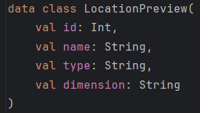

Une fois le modèle créé, on peut ajouter le nouveau champ dans le modèle Character.

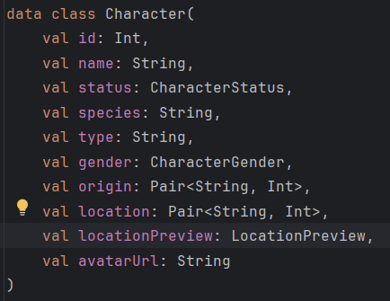

Suite à la création du nouveau modèle, on peut créer l'interface LocationPreviewRepository en prévision des futures requêtes.
On peut ajouter les deux fonctions suivantes dans le fichier LocationPreviewReposiroty:

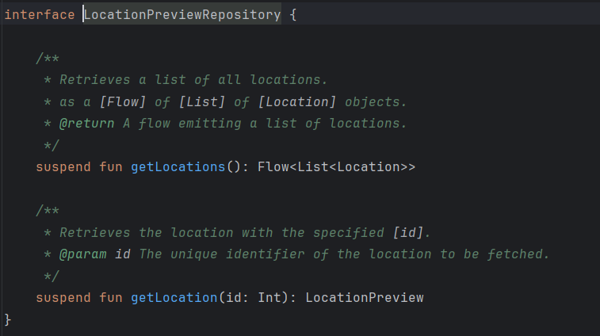

## Épreuve 2. Visualiser les Locations et accéder à leurs détails

Le but de cette épreuve est de récupérer la Location d'un Character et de l'afficher dans son détail.
Dans un second temps, il faut aussi pouvoir naviguer sur une nouvelle page nous affichant les détails de la Location.

Pour se faire, nous allons nous attaquer à la couche Data.

En se basant sur la partie Character dans le fichier CharacterRepositoryImpl, nous pouvons voir que nous aurons besoin de deux nouveaux fichiers:
- LocationPreviewLocal qui tentera de récupérer la Location d'un Character en local
- LocationPreviewAPI qui tentera de récupérer la Location d'un Character en utilisant une API

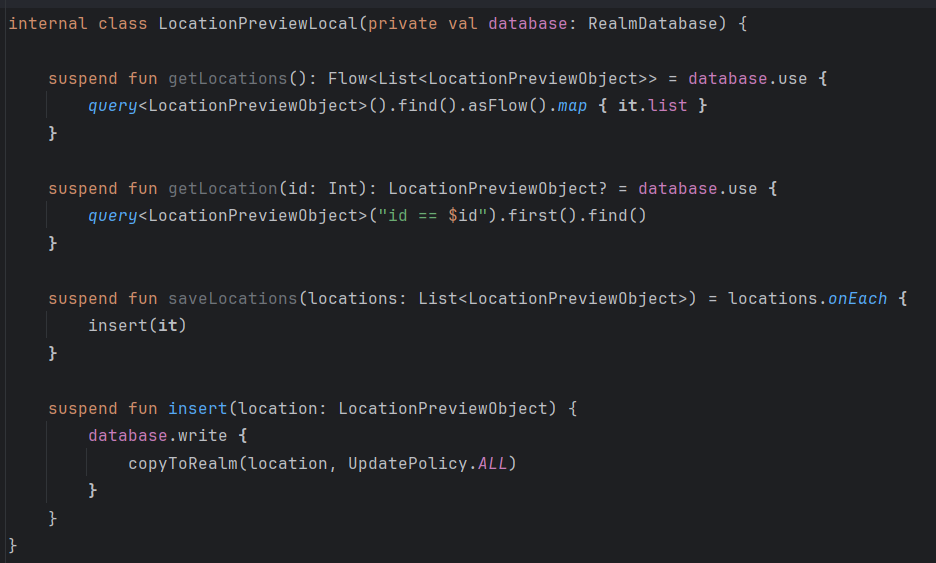
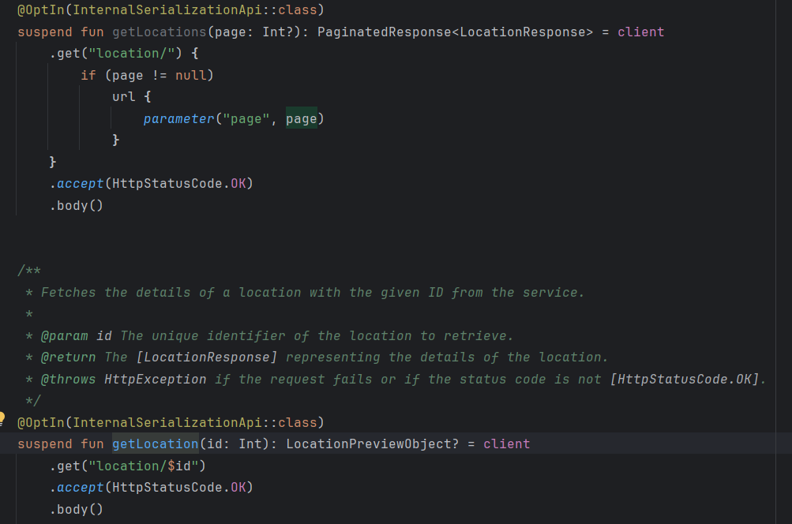

Pour faire fonctionner tout ça nous aurons besoin d'un nouvel objet LocationPreviewObject
Cet objet nous permettra de faire le lien entre les objets utilisables en BDD et le model LocationPreview.

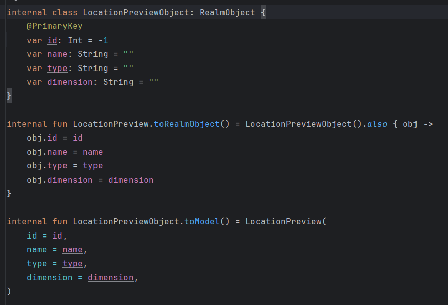

Nous devons indiquer à l'application comment ordonner les données reçues par l'API, pour se faire nous allons créer un objet LocationPreviewResponse.

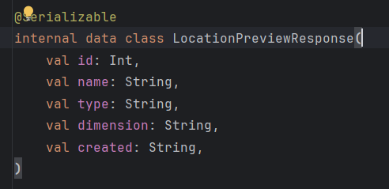

Nous allons aussi modifier la réponse concernant les Characters afin d'y ajouter le champ LocationPreview.

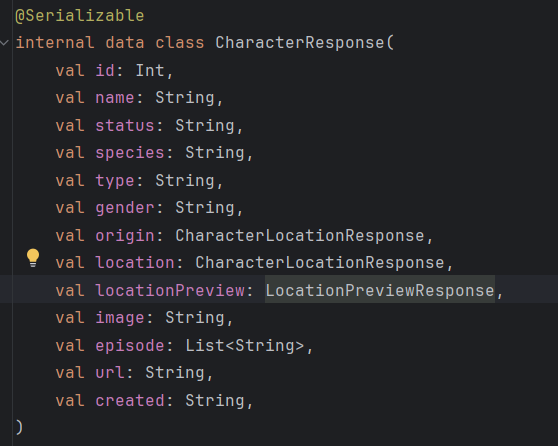

Maintenant il ne nous reste qu'a récupérer la bonne Location au moment du chargement de la page de détail d'un Character.

Pour se faire nous allons modifier le reposiroty CharacterRepositoryImpl.

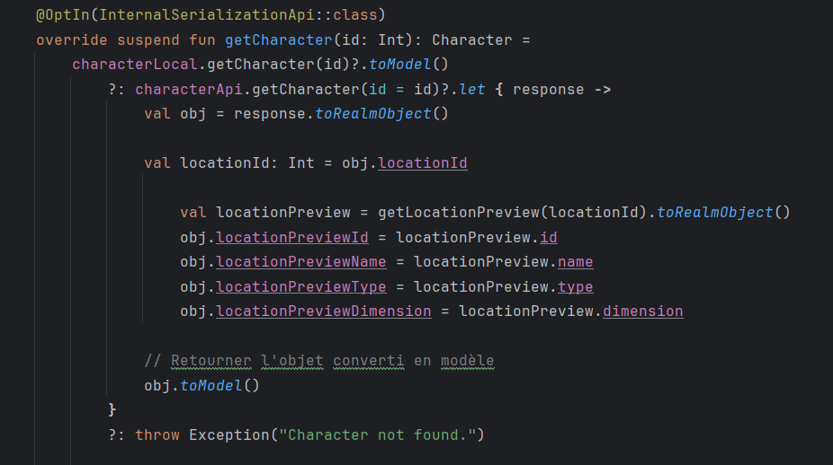

Nous modifions la fonction getCharacter pour que lors qu'elle récupère le Character souhaité elle en profite pour récupérer la Location associée.
Pour se faire nous utilisont le praamètre locationId depuis le type CharacterObject.

Cet Id nous permet de rechercher la Location par son Id et de l'associer au Character.
Une fois associée, nous renvoyons le Character sous la forme du model Character.

Nous voulons maintenant afficher cela dans l'écran de détail d'un Character.

Pour se faire nous allons modifier le fichier CharacterDetailsViewModel.

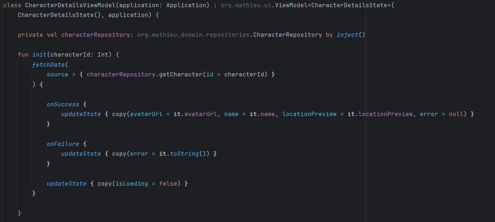

Nous ajoutons la propriété locationPreview dans le State qui sera utilisé dans l'écran de détail.

Nous pouvons ensuite appeler le state pour afficher les informations dans la carte dans l'ecran CharacterDetailsScreen.

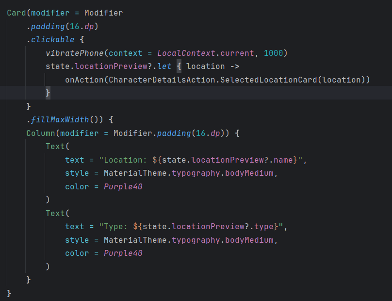

Pour finir, nous voulons pouvoir naviguer vers une nouvelle page affichant les détails de la Location

En se basant sur la navigation déja présente pour naviguer depuis CharactersScreen vers CharacterDetailsScreen, nous créons la route et l'évènement de navigation.

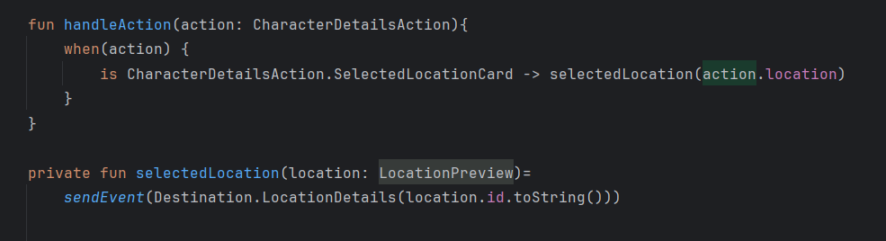

Enfin nous voulons que le téléphone vibre lors que l'on clique sur la carte.
On créé une nouvelle méthode dans le CharacterDetailsViewModel.

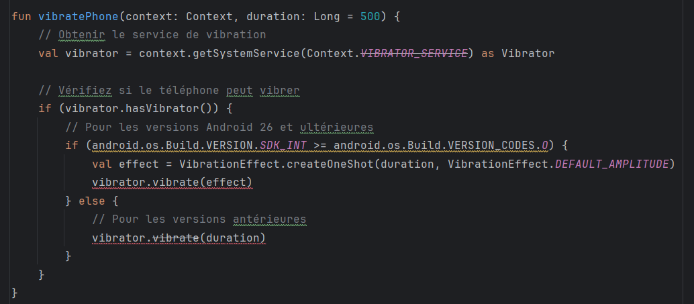

Et nous pouvons maintenant appeler cette méthode au click dans l'écran CharacterDetailsScreen.